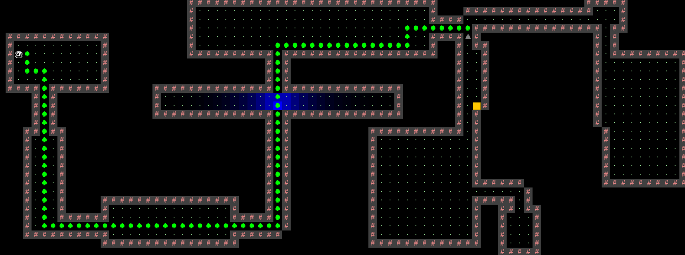

# Chasing Game

> **Introduction:** In this game, a prince is stuck in a maze where a monster is chasing him. Once the monster got him, he will die. In the desperate hours, he must do his best to avoid the monster and escape the maze via the only door.  

This project implemented a 2D tile-based world exploration engine.

# Prerequisite
- `IntelliJ IDEA Community Edition 2022.1.3  `
- `JDK-17.0.3.7-hotspot`

# Setup
Download `algs4.jar` in `library` and add it to library. 
> **Details:** In IntelliJ, `File` -> `Project Structure` -> `Project Settings` -> `Libraries` -> `New Project Library` -> Add and finish.

Then you can `Run` the game in Main.

# Instructions
Home Page. Press `N` to start a new world. Press `L` to load from the previous play.

Input seed to generate random maze.

Select difficulty mode.

Play the game. Move your avatar with `ASDW`.
